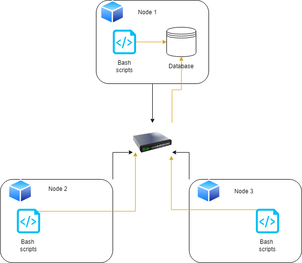

# Introduction
This project consist in collecting hardware specification and resource usage data from different Linux computers and then storing it into a psql database hosted on a single machine. The goal is to have a monitoring agent that tracks nodes in a Linux cluster in real time but since this is an MVP,
the scope is limited to a single linux host machine. Here are the technologies used in this project:
1. Google Cloud Platform was used to create and start a VM instance.
2. GitHub was used to for creating a repository to host the code using GitFlow branching model to structure feature releases.
3. Docker was used to pull a psql image from Docker Hub and creating the container which ran the psql instance.
4. PSQL CLI tool was used to connect to a psql instance and execute sql files.
5. Bash scripts were used to implement start|stop|create functionality for the psql container, collecting hardware specification and resource usage data that would then be inserted into the psql database.
6. SQL scripts were used to create the database tables and making queries.
7. Crontab was used for executing the resource usage script every minute 

# Quick Start
- Start a psql instance using psql_docker.sh
<pre>
# Note that you can also stop or create the psql instance by changing the first CLI argument to either start or stop
  path/to/project/linux_sql/scripts/psql_docker.sh start db_username db_password   

# Connect to a psql instance
  psql -h HOST_NAME -p 5432 -U USER_NAME
</pre>
- Create tables using ddl.sql
<pre>
# Execute ddl.sql script
  psql -h HOST_NAME -p 5432 -U USER_NAME -d DB_NAME -f path/to/project/sql/ddl.sql
</pre>
- Insert hardware specs data into the DB using host_info.sh
<pre>
# Execute host_info.sh script
  path/to/project/scripts/host_info.sh "HOST_NAME" 5432 "DB_NAME" "USER_NAME" "PASSWORD"
</pre>
- Insert hardware usage data into the DB using host_usage.sh
<pre>
# Execute host_usage.sh script
  path/to/project/scripts/host_usage.sh "HOST_NAME" 5432 "DB_NAME" "USER_NAME" "PASSWORD"
</pre>
- Crontab setup
<pre>
# Edit cron job
  crontab -e

# Schedule for host_usage.sh script to be executed every minute and store the result into a host_usage log file
  * * * * * bash path/to/project/linux_sql/host_agent/scripts/host_usage.sh "HOST_NAME" 5432 "DB_NAME" "USER_NAME" "PASSWORD" > /tmp/host_usage.log
  
# Verify that the job was successful by listing to cron jobs
  crontab -ls
</pre>

# Implementation
Before anything else, we have to initialize a GitHub repository and use GitFlow branching model to structure our feature releases. Once that's done, we can go ahead and create a postgres database using docker container to pull a psql image from
Docker Hub. We can then implement a bash script that start|stop|create the psql container automatically. With our database now setup we can go ahead and create 2 bash scripts that collect data and insert it into the psql database.
The first one `host_info.sh` is used for hardware specifications and the second one `host_usage.sh` for ongoing Linux resource usage data. What is left to do now is to create a psql script named `ddl.sql` that creates 2 tables for each one of our data collection scripts.
Finally, we want to have the `host_usage.sh` script execute every minute in order to collect data continuously. To do so, we simply run a cron job. 

## Architecture

The 2 Bash Agent scripts which gathers server user data, and inserts it into the pql instance, are run on every node in the Linux cluster. The `host_info.sh` runs only once to collect and insert hardware information into the database while the `host_usage.sh` script collects and inserts host usage data 
into the database every minute, using the `crontab` scheduler.
## Infrastructure

Above is an infrastructure diagram of the project, which provides and overview of the technology used and its interactions.

## Scripts
- psql_docker.sh is used to start|stop|create the psql container.
- host_info.sh is used to collect and insert hardware information into the psql database.
    - `id:`Unique primary key used to identify host/node and is auto-incremented by PostgreSQL 
    - `hostname:`The name of the computer or device.
    - `cpu_number:` The number of cpu cores.
    - `cpu_architecture:` The type of architecture implemented by the cpu.
    - `cpu_model:` The model and processor speed of the cpu.
    - `cpu_mhz:` The CPU's clock/processor speed.
    - `l2_cache:` CPU cache memory located outside and separate from the microprocessor chup core.
    - `total_mem:` Total physical memory or how much RAM is installed on the computer.
    - `timestamp:` Current time in UTC time zone.
- host_usage.sh  is used to collect and insert resource usage into the psql database.
    - `timestamp:`Current time in UTC time zone.
    - `host_id:` Mapped to the `id` from the `host_info` table.
    - `memory_free:` The memory available to the operating system.
    - `cpu_idle:` Percentage of cpu available when idle.
    - `cpu_kernel:`Percentage of time spent running kernel code. 
    - `disk_io:`Number of disk I/O blocks.
    - `disk_available:`Root directory available disk in MB
- crontab  is used to run the `host_usage` script every minute.

- ddl.sql  is used to create our `host_info` and `host_usage` table.

- queries.sql  is used to construct more complicated queries. For example there's a query that detects host failure by looking how many data points are inserted within a 5-min interval.

## Database Modeling
- `host_info`

| id  |hostname|cpu_number|cpu_architecture|cpu_model|cpu_mhz|l2_cache|total_mem|timestamp|
|:---:|:------:|:--------:|:--------------:|:-------:|:-----:|:------:|:-------:|:-------:|

- `host_usage`

|timestamp|host_id|memory_free|cpu_idle|cpu_kernel|disk_io|disk_available|
|:-------:|:-----:|:---------:|:------:|:--------:|:-----:|:------------:|

# Test
#### Bash scripts
1. Debug the bash scripts using `bash -x` command
2. Look at the database tables to see if the values have been inserted.
#### SQL scrips
1. Run the ddl script and make sure both tables are created.
2. Run the sql queries and make sure the resulting table is correct

# Deployment
How did you deploy your app? (e.g. Github, crontab, docker)
The following requirements are needed to deploy this app:
1. A GitHub account setup to clone the repository.
2. Docker installed to run our psql container.
3. A task scheduler on your operating system. On Linux we used Crontab.
4. Good to have but not necessary is an ide that supports bash scripts and database management functionality

# Improvements
- The SQL queries can be optimized by using SQL window functions
- The tables can be improved by using the same file size for each table column. For example, total_mem stores the value in KB while memory_free stores its value in MB which can lead to confusion.
- The host_info and host_usage scripts contain different commands for data collection because I wanted to familiarise myself with the different possible solutions. Unfortunately, it makes the code harder to read. So Ideally, the code would contain the same commands that we
could have then stored in a function.
